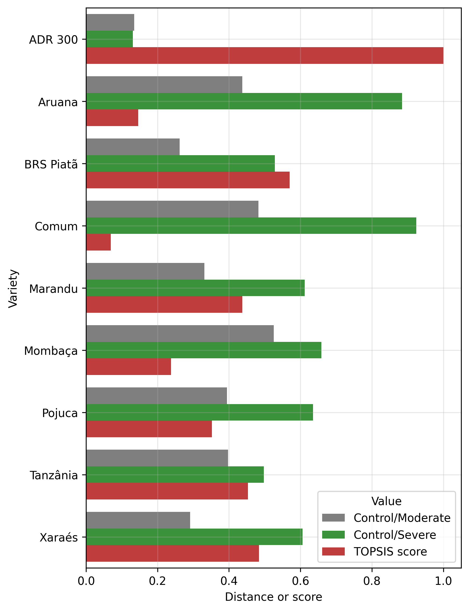

# Selection of forage grasses for cultivation under water limited conditions using Manhattan distance and TOPSIS

## Abstract

Extreme weather events, such as severe droughts, pose a threat to the sustainability of beef cattle by limiting the growth and development of forage plants and reducing the available pasture for animals. Thus, the search for forage species that are more tolerant and adapted to soil water deficit conditions is an important strategy to improve the food supply of Brazilian livestock. In this study, we propose utilizing the mathematical concept of Manhattan distance (or similarity) to assess the variations in morphological variables of tropical forage grasses under water limited conditions. This study aimed to select genotypes of tropical forage grasses under different water stress levels (moderate or severe) using the Manhattan distance and Technique for Order Preference by Similarity to Ideal Solution (TOPSIS). Nine varieties from five species were examined, including Urochloa brizantha (“BRS Piatã,” “Marandu,” and “Xaraés”), Urochloa ruziziensis (“Comum”), Panicum maximum (“Aruana,” “Mombaça,” and “Tanzânia”), Paspalum atratum (“Pojuca”), and Pennisetum glaucum (“ADR 300”). Forage grasses were grown in 12-L pots under three soil irrigation regimes [100% of pot capacity – PC (well-irrigated control), 60% of PC (moderate drought stress), and 25% of PC (severe drought stress)] with four replicates. Drought stress treatments were applied for 25 days during the forage grass’s tillering and stalk elongation phases. After exposure to drought stress, the growth and morphological traits of forage plants were evaluated. The results show that the use of the Manhattan distance combined with TOPSIS helps in the genotypic selection of more stable tropical forage grass varieties, when comparing plants exposed to moderate and severe drought conditions in relation to the non-stressful environment (control). The “ADR 300”, “Pojuca”, “Marandu”, and “Xaraés” varieties show greater adaptation and stability when grown in a greenhouse and subjected to water stress environments. therefore, these selected varieties must be tested under field conditions to confirm their best performance in forage production under water stress conditions. The selected forage varieties can be used as parents in plant breeding programs, allowing to obtain new drought resistant genotypes.

Keywords: abiotic stress; muti-criteria selection; Panicum sp, Urochloa sp.

## Authors

Bruno Rodrigues de Oliveira (1)*, Marco Aparecido Queiroz Duarte (2), Alan Mario Zuffo (3), Fábio Steiner (4), Jorge González Aguilera (1,4) Alexson Filgueiras Dutra (5), Francisco de Alcântara Neto (6), Marcos Renan Lima Leite (6), Nágila Sabrina Guedes da Silva (6), Eliseo Pumacallahui Salcedo (7), Luis Morales-Aranibar (7), Richar Marlon Mollinedo Chura (8), Roger Ccama Alejo (8), Wilberth Caviedes Contreras (9)

1 Pantanal Editora, Rua Abaete, 83, Sala B, Centro. Nova Xavantina-MT, Brasil.

2 Departamento de Matemática, Universidade Estadual de Mato Grosso do Sul (UEMS), Unidade de Cassilândia, Rodovia MS 306 - km 6,4, Cassilândia-MS, Brasil.

3 Departamento de Agronomia, Universidade Estadual do Maranhão (UEMA), Praça Gonçalves Dias, Balsas-MA, Brasil.

4 Departamento de Agronomia, Universidade Estadual de Mato Grosso do Sul (UEMS), Unidade de Cassilândia, Rodovia MS 306 - km 6,4, Cassilândia-MS, Brasil. 5 Instituto Federal do Piauí, Uruçuí, Piauí, Brasil.

6 Programa de Pós-Graduação em Agronomia, Universidade Federal do Piauí Teresina, Piauí, Brasil.

7 Departamento de Ingeniería Civil y Ciencias Básicas, Universidad Nacional Intercultural de Quillabamba (UNIQ), Cusco 08741, Perú.

8 Departamento Académico de Ciencias Físico Matemáticas, Universidad Nacional del Altiplano - Puno, Puno 21001, Perú.

9 Departamento Académico de Ciencias Básicas, Universidad Nacional Amazónica de Madre de Dios (UNAMAD), Madre de Dios 17001, Perú.

Corresponding author: bruno@editorapantanal.com.br

Pantanal Editora, Rua Abaete, 83, Sala B, Centro. Nova Xavantina-MT, Brasil.

# Main result

Normalized Manhattan distances calculated between samples from the control and water stress environments and the TOPSIS score obtained using these distances as criteria, for each forage grass variety.

